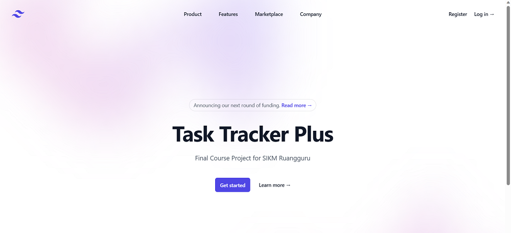

# Task Tracker Plus

## Final Course Project - Task Tracker Plus

### Description

**Task Tracker Plus** is an extension of a previous assignment designed to help students manage their study schedules. This application is built using the Go programming language (Golang) and implements **REST API** concepts along with **MVC (Model-View-Controller)** architecture. This is a **monolith** application, where the server, logic, database, and user interface are all integrated into one system.

### Features Highlight

#### Key Features Implemented:

1. **Backend Development (Server)**
   - Developed and implemented **REST APIs** to manage **Users, Tasks, and Categories**, ensuring a structured approach to data handling.
   - Integrated user authentication to secure access to features that require login.
   - Implemented full CRUD (Create, Read, Update, Delete) operations for **tasks** and **categories**, with access control based on user roles.
   - Utilized the `db/filebased` subpackage for file-based data management, offering simple and efficient data storage and retrieval solutions.

2. **Frontend Development (Client)**
   - Built the user interface using the **MVC (Model-View-Controller)** pattern to separate business logic from presentation.
   - Developed **Login and Registration** pages for user authentication.
   - Created a **Dashboard** page for users to view and manage their tasks and categories.
   - Implemented **Task** and **Category** management features accessible from the user interface, allowing users to add, update, and delete entries easily.

### REST API Endpoints

#### Server (Backend)

- **Users**
  - **POST** `/user/register`: Register a new user.
  - **POST** `/user/login`: Login to the application.
  - **GET** `/user/tasks`: Retrieve a list of users with their tasks and categories.

- **Tasks**
  - **POST** `/task/add`: Add a new task.
  - **GET** `/task/get/:id`: Retrieve task details by ID.
  - **PUT** `/task/update/:id`: Update task information.
  - **DELETE** `/task/delete/:id`: Delete a task.
  - **GET** `/task/list`: Get a list of tasks.
  - **GET** `/task/category/:id`: Get tasks by category ID.

- **Categories**
  - **POST** `/category/add`: Add a new category.
  - **GET** `/category/get/:id`: Retrieve category details by ID.
  - **PUT** `/category/update/:id`: Update category information.
  - **DELETE** `/category/delete/:id`: Delete a category.
  - **GET** `/category/list`: Get a list of categories.

> **Note**: Users must be logged in to access the `task` and `category` endpoints.

#### Client (Frontend)

- **Index**
  - The landing page of the application, accessible at `/`.

- **Users**
  - Display the login page at `/client/login`.
  - Process user authentication at `/client/login/process` using the **POST** method.
  - Display the registration page at `/client/register`.
  - Process user registration at `/client/register/process` using the **POST** method.
  - Logout users with the endpoint `/client/logout`.

- **Dashboard**
  - Display the user dashboard at `/client/dashboard`.

- **Tasks**
  - Display tasks at `/client/task`.

- **Categories**
  - Display categories at `/client/category`.

- **Modal**
  - Display modals at `/client/modal`.
